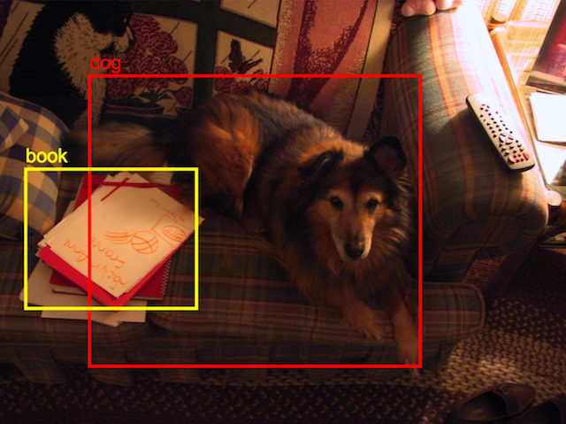

# Vision app

## 🚧 Caution: this project is under construction! 🚧

Use your device's camera to run object detection on the world around you.



## Online demo

[You can see a demo here](https://vision.prawn.farm)

## Developer Usage

```sh
cargo web start --target=wasm32-unknown-unknown
```

## Attribution

Much of the [HTML and javascript basis](static/index.html) were made possible through openly licensed work from the [Tensorflow.js COCO-SSD model](https://github.com/tensorflow/tfjs-models/tree/master/coco-ssd).  Thank you.

The drawing of bounding boxes was mostly made possible by [Paul Irish's demo of multi-touch](https://www.paulirish.com/demo/multi).