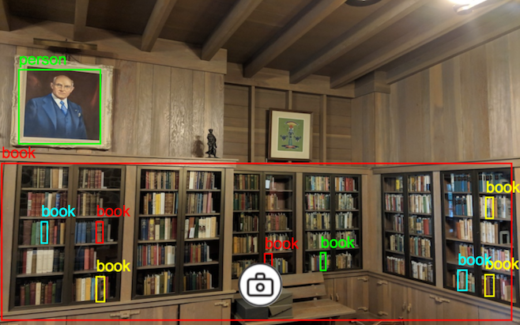

# Vision app

## 🚧 Caution: this project is under construction! 🚧

Use your device's camera to run object detection on the world around you.



## Online demo

[You can see a demo here](https://vision.prawn.farm)

## Building the app

You need to install [binaryen](https://github.com/WebAssembly/binaryen) in order to have
access to `wasm-opt`, which will help to shirkn the final
size of the wasm binary.

Through a combination of building in release mode, compiling
with Link Time Optimizations (LTO), telling LLVM to optimize
for size instead of speed, and running `wasm-opt`, we can
reduce the size of the final wasm binary by as much as 80%.

We recommend reading https://rustwasm.github.io/book/reference/code-size.html#optimizing-builds-for-code-size for additional information.

See [our build script](build.sh) for the exact commands
that we use to build the application.

See the `[profile.release]` section of [Cargo.toml](Cargo.toml) to
take a look at the LLVM optimizations used during the build.

### Development Mode

The following command will keep a copy of the app
running locally, if you want to play
around with the code.

```sh
cargo web start --target=wasm32-unknown-unknown
```

## Attribution

Much of the [HTML and javascript basis](static/index.html) were made possible through openly licensed work from the [Tensorflow.js COCO-SSD model](https://github.com/tensorflow/tfjs-models/tree/master/coco-ssd).  Thank you.

The drawing of bounding boxes was almost entirely made possible by [Paul Irish's demo of multi-touch](https://www.paulirish.com/demo/multi). Thank you.
